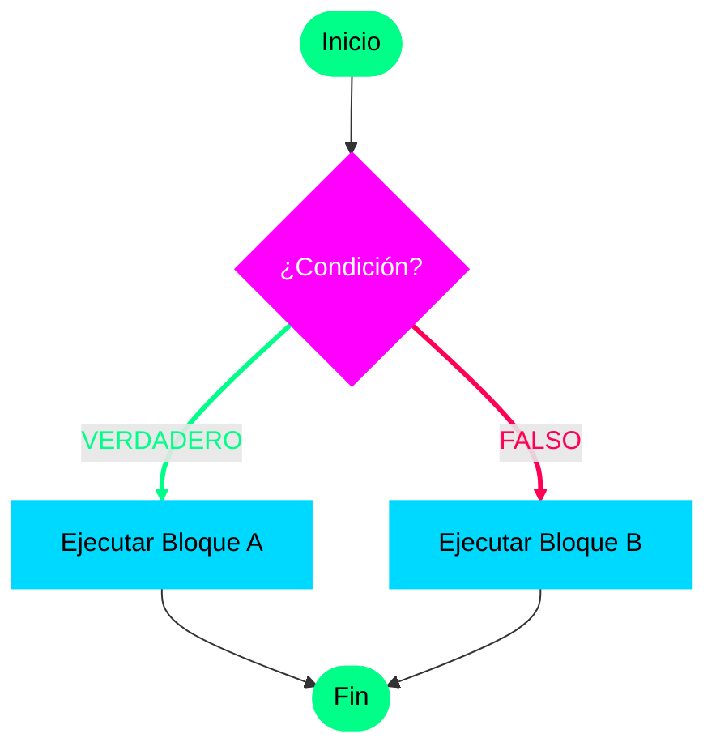

# Introducción a las Estructuras de Selección

En el mundo de la programación, no siempre queremos que nuestro código se ejecute como una simple lista de mercado, de arriba hacia abajo sin detenerse. A veces, necesitamos que nuestro algoritmo **tome decisiones**.

## ¿Qué es la Selección?

Una **estructura de selección** es una instrucción que nos permite ejecutar un bloque de código específico dependiendo de si se cumple o no una **condición**. 

Imagina que el flujo de tu programa es un camino: hasta ahora hemos caminado en línea recta (flujo secuencial). La selección es como llegar a un cruce de caminos donde, dependiendo de una señal (la condición), eliges ir por la izquierda o por la derecha.

> [!IMPORTANT]
> Una condición siempre se evalúa como **Verdadera** o **Falsa** (valores lógicos).

---

## Del Código Secuencial al Flujo Alternativo

En las lecciones anteriores, vimos que cada línea se ejecuta una tras otra. Pero con la selección, podemos **omitir** secciones enteras o elegir entre **alternativas**.

### Ejemplos en la vida real:

1.  **Clasificación de Trato**: 
    *   **Si** la persona es hombre → Mostrar "Bienvenido, Señor".
    *   **Si** la persona es mujer → Mostrar "Bienvenida, Señora".

2.  **Validación Matemática**:
    *   **Si** el residuo de un número dividido entre 2 es cero → El número es **Par**.
    *   **Si no** → El número es **Impar**.

3.  **Seguridad Vial (Física)**:
    *   **Si** la velocidad calculada es mayor a 100 km/h → Mostrar alerta: "¡Oye! Estás sobrepasando los límites de velocidad".

---

## Estructuras en UDONE

En la **Universidad de Oriente (UDONE)**, utilizaremos tres estructuras principales para manejar estas decisiones:

| Estructura | Propósito |
| :--- | :--- |
| **Si (If)** | Para ejecutar algo solo si se cumple una condición única. |
| **Si - Sino (If-Else)** | Para elegir entre dos caminos obligatorios. |
| **Caso (Switch/Case)** | Para elegir entre múltiples opciones basadas en el valor de una variable. |

---

## Representación Visual (Diagrama de Flujo)

Así es como se ve lógicamente una decisión. Observa el rombo, que es el símbolo universal para representar una condición en programación.

---

## Próximos Pasos

En los siguientes capítulos profundizaremos en la sintaxis exacta de cada una:

*   [La estructura Si (Selección Simple)](./2-si-entonces.md)
*   [La estructura Si-Sino (Selección Doble)](./3-si-sino.md)
*   [La estructura Caso (Selección Múltiple)](./4-caso.md)
