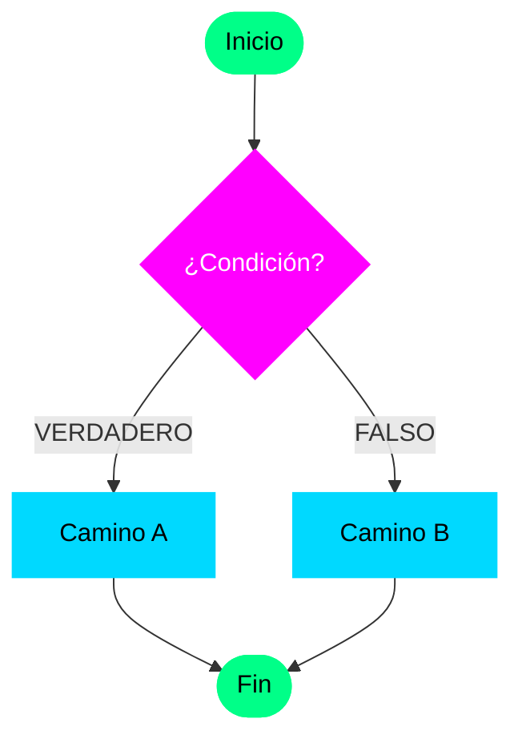

# Estructura de Selección Doble (Si...Sino) y Anidación

Siguiendo la misma lógica de la estructura **Si**, ahora veremos el **Si...Sino (If...Else)**. Esta estructura mantiene el uso de paréntesis para la condición, pero añade una funcionalidad clave: si la operación resulta falsa, se ejecutará un bloque de código alternativo.

La particularidad de esta estructura es que, en cada ejecución de nuestro programa, habrá un segmento de código que **no se ejecutará**. Al trabajar con algoritmos, veremos secciones que se activan dependiendo del flujo; es como una bifurcación en el camino donde elegimos un lado u otro.

## El concepto de Anidación

Hasta ahora, hemos visto algoritmos con estructura lineal, pero en la práctica necesitamos la **Anidación**. La anidación es el acto de colocar un bloque de código dentro de otro.

En nuestro caso, dentro de un bloque **Si**, podríamos colocar otro **Si**, y dentro de ese, otro más. También es muy común colocar un **Si** dentro del bloque del **Sino**. Para que esto no sea confuso, es vital seguir dos reglas de oro:

1.  **Cerrar cada bloque**: Siempre debemos usar la instrucción **Fin Si** para indicar exactamente dónde termina cada estructura. Aunque en algunos lenguajes el cierre es implícito, aquí siempre lo marcaremos para evitar errores de lógica.
2.  **Indentación (Sangría)**: Al abrir un bloque, debemos dar un pequeño espacio hacia la derecha. Esto nos permite diferenciar visualmente qué instrucciones pertenecen a cada nivel. Los entornos de desarrollo modernos incluso dibujan líneas verticales para guiar tu vista entre la apertura y el cierre.

---

## Sintaxis en UDONE

```pseudocode
Si (Condición) Entonces
    // Camino Verdadero
Sino
    // Camino Falso
Fin Si
```

---

## Ejemplos Prácticos para los Estudiantes

Para aplicar estos conceptos, desarrollaremos los siguientes desafíos:

### 1. Par o Impar
Un algoritmo clásico para decidir entre dos caminos exclusivos. Es la introducción perfecta a la bifurcación.

### 2. El mayor de tres números
Este es el ejemplo perfecto para practicar la **anidación**, ya que debemos comparar el primer número con el segundo, y el resultado de esa comparación con el tercero.

### 3. Piedra, Papel o Tijera
Un algoritmo para determinar el ganador evaluando múltiples condiciones anidadas. Aquí la lógica se vuelve más interesante.

### 4. Cálculo de Sueldo (Completo)
Un ejercicio que mezcla cálculos matemáticos con decisiones:
*   Sueldo base de 100 Bolívares.
*   **Si** la persona trabaja más de 40 horas → Bono del 50% sobre su sueldo.
*   **Al final**, se resta un impuesto del 15% sobre el sueldo total obtenido.

---

## Visualización


