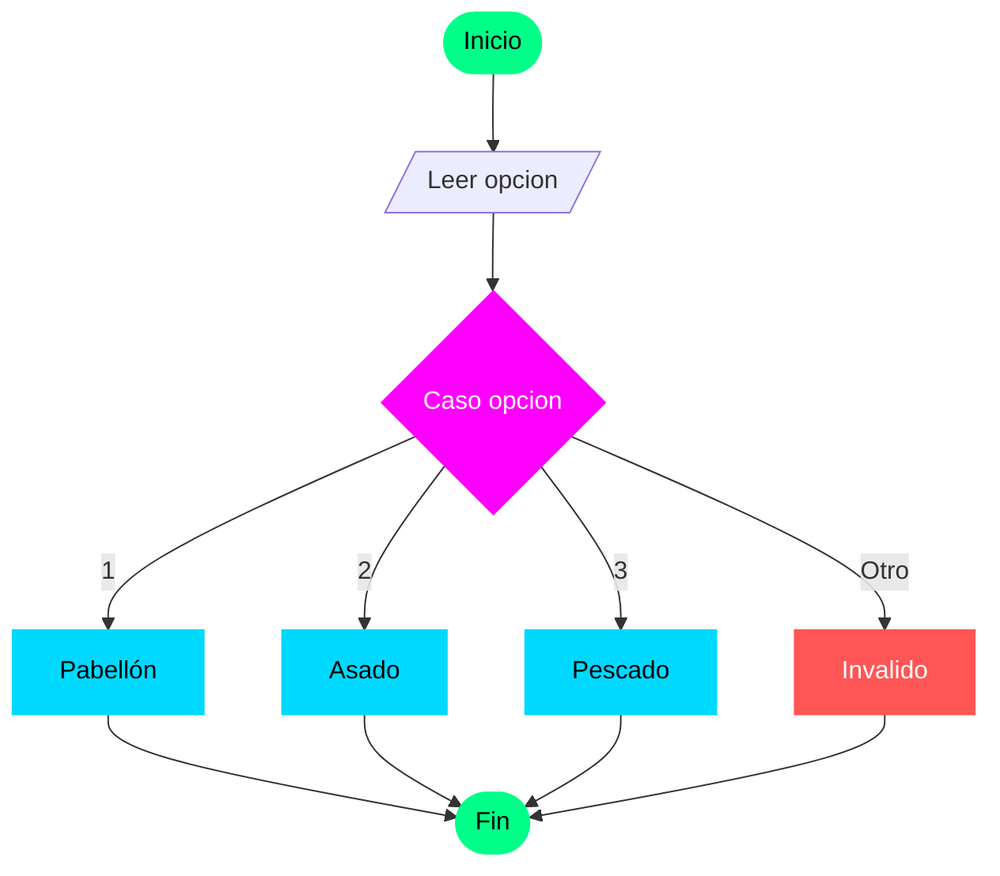

# Estructura de Selección Múltiple: Caso (Switch)

Cuando tenemos una variable que puede tomar muchos valores específicos (como un menú de opciones o los días de la semana), usar muchos "Si - Sino" anidados puede volverse confuso. Para estos casos, UDONE utiliza la estructura **Caso**.

## Sintaxis en UDONE

```pseudocode
Caso <Variable>
  Valor1: <Instrucciones>
  Valor2: <Instrucciones>
  Valor3: <Instrucciones>
  Sino: <Instrucciones_por_defecto>
Fin Caso
```

---

## Ejemplo Práctico: Menú de Comida

Imagina un sistema de pedidos simple.

**Enunciado:** Diseñe un algoritmo que permita al usuario elegir una opción de un menú (1 al 3) y muestre el plato correspondiente. Si elige otro número, debe indicar que la opción no es válida.

### Solución:

```pseudocode
Algoritmo Menu_Restaurante
  Variables:
    opcion: Entero

Inicio
  Escribir "MENÚ DEL DÍA:"
  Escribir "1. Pabellón Criollo"
  Escribir "2. Asado Negro"
  Escribir "3. Pescado Frito"
  Escribir "Elija su opción: "
  Leer opcion

  Caso opcion
    1: Escribir "Has elegido: Pabellón Criollo"
    2: Escribir "Has elegido: Asado Negro"
    3: Escribir "Has elegido: Pescado Frito"
    Sino: Escribir "Opción no válida. Intente de nuevo."
  Fin Caso
Fin
```

---

## Reglas Importantes del "Caso"

1.  **Variable de control**: Normalmente es de tipo **Entero** o **Carácter**.
2.  **Valores específicos**: No se usa para rangos (como "mayor que 10"), sino para valores exactos.
3.  **El Sino**: Es opcional, pero se recomienda usarlo para atrapar cualquier valor que no hayamos previsto (manejo de errores).

---

## Visualización


