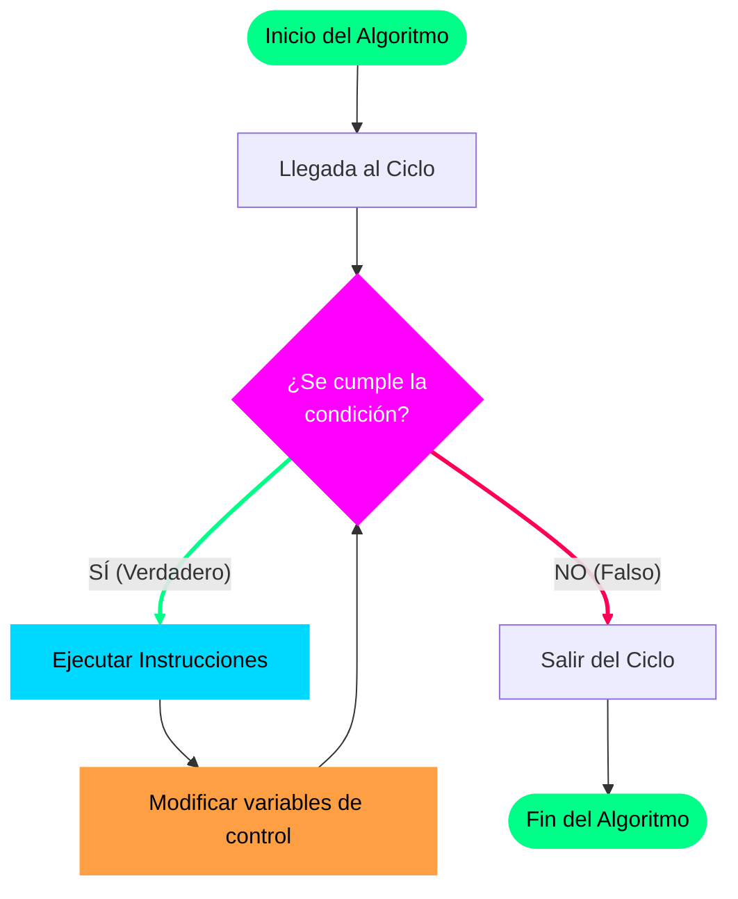

# Capítulo 1: Introducción a los Ciclos Repetitivos

En la programación, no siempre queremos escribir las mismas instrucciones una y otra vez de forma manual. Si tuvieras que mostrar en pantalla los números del 1 al 1000, escribir mil líneas de `Escribir` sería ineficiente y propenso a errores. Para resolver esto, los lenguajes de programación utilizan los **Ciclos Repetitivos** (también conocidos como bucles o lazos).

---

## ¿Qué es un Ciclo Repetivo?

Un **ciclo** (o bucle) es una estructura de control que permite ejecutar de forma repetida un segmento de código específico, siempre y cuando se cumpla una condición determinada en un momento dado. 

Cada repetición individual de las instrucciones dentro del ciclo recibe el nombre de **iteración**.

---

## La Analogía del Salón de Clases

Para entender la lógica de un ciclo, pensemos en una situación cotidiana muy sencilla: **Contar secuencialmente cuántos estudiantes hay dentro de un salón de clases.**

Imagina que eres el profesor y estás parado en la puerta del salón vacío. Tu objetivo es contar a cada estudiante que entra. ¿Cómo lo harías siguiendo la lógica de un ciclo?

1.  **Estado Inicial (Antes de empezar)**: Tu contador de estudiantes empieza en `0`.
2.  **La Condición de Entrada**: Observas la puerta. Si ves que viene un estudiante (condición verdadera), realizas la acción.
3.  **El Proceso (Iteración)**:
    - El estudiante entra al salón.
    - Tú incrementas tu cuenta mental en 1 (nuevo valor = anterior + 1).
4.  **El Bucle**: Vuelves a mirar la puerta. Si hay otro estudiante, repites el paso 3.
5.  **La Condición de Salida**: Miras la puerta y ya no viene nadie más (condición falsa). En ese momento **detienes el conteo**.
6.  **Resultado**: Anotas el número total acumulado.

Si no planificaras una vía de salida (por ejemplo, si siguieras contando infinitamente incluso si el salón ya está lleno y la puerta está cerrada), quedarías atrapado en un bucle sin fin.

---

## Lógica de Control: Entrada y Salida

Todo diseño algorítmico robusto exige comprender que los ciclos poseen dos componentes lógicos indispensables:
1.  **Mecanismo de Entrada:** Una condición lógica que determina si el ciclo tiene permiso de iniciar o continuar su ejecución.
2.  **Vía de Salida:** Una garantía de que en algún momento la condición se volverá falsa.

> [!IMPORTANT]
> **La regla de oro de los ciclos:** La vía de salida es de cumplimiento obligatorio. Como programador, debes garantizar que las instrucciones internas modifiquen los datos de tal manera que el ciclo siempre tenga una forma de finalizar. Ignorar esto provoca un **ciclo infinito**, congelando el sistema y consumiendo toda la memoria disponible.

---

## Los Tres Ciclos del Plan de Estudios (UDONE)

En la Universidad de Oriente (UDONE), abordaremos tres estructuras cíclicas principales para resolver cualquier problema de repetición. Aunque todas sirven para repetir código, cada una tiene un propósito y momento ideal de uso:

| Estructura | ¿Cuándo se usa? | Características Clave |
| :--- | :--- | :--- |
| **Mientras (While)** | Cuando no sabemos exactamente cuántas veces se repetirá el ciclo. | Evalúa la condición **antes** de ejecutar el código (puede ejecutarse 0 veces). |
| **Repetir (Do-While / Repeat)** | Cuando necesitamos que el código se ejecute **al menos una vez** antes de validar. | Evalúa la condición **al final** del ciclo. |
| **Para (For)** | Cuando sabemos **de antemano** la cantidad exacta de repeticiones a realizar. | Controla de forma automática la inicialización, límite e incremento de una variable. |

En las siguientes lecciones profundizaremos en el funcionamiento, la sintaxis y los secretos de cada uno de estos ciclos.

---

## Diseño

- **Componente Interactivo:** "Loop Classroom Simulator".
- **Visualización:** Un gráfico interactivo bidimensional de un salón de clases con pupitres y una puerta. Un panel lateral mostrará un contador numérico de "Estudiantes" y el código del algoritmo simplificado al lado.
- **Interactividad:**
  - Botón de "Iniciar Simulación". Al presionarlo, los estudiantes avanzan uno a uno desde la puerta hasta su pupitre.
  - Con cada estudiante que entra, se resalta la línea de código correspondiente (`estudiantes <- estudiantes + 1`) y el contador se incrementa con una animación suave de rebote.
  - Posibilidad de ajustar la velocidad de animación o pausarla para analizar el flujo paso a paso.
- **Estética:** Gradientes modernos en tonos oscuros (cyberpunk o space tech), luces neon cian (`#00d9ff`) para los estudiantes y verde vibrante (`#00ff88`) para el contador de estado.
