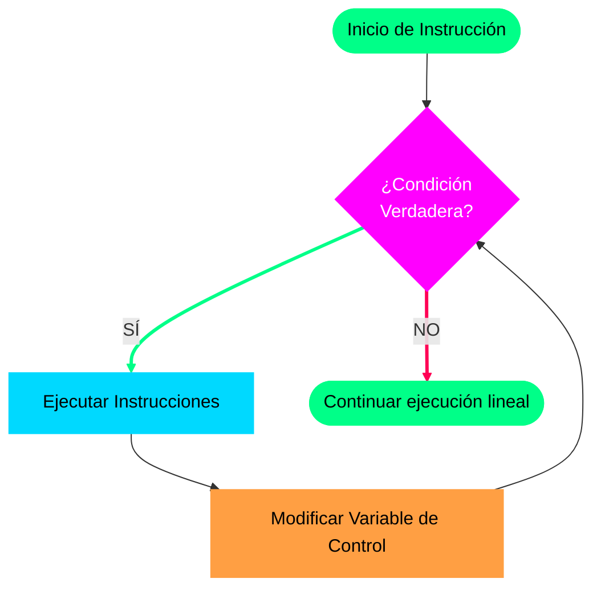

# Apoyo Visual: El Ciclo "Mientras" y Control por Decremento (Parte 2)

**Fecha de creación del artículo:** 19/05/2026  
**Referencia de Video:** Publicado originalmente el 10 de marzo de 2021  
**Enlace al video:** [Ver en YouTube (Enlace Oficial)](https://youtu.be/J6q6NchWwF8)  
**Canal:** AlejjandroDev  
**Métrica de la Clase:** Video 2/4 sobre Estructuras Repetitivas

---

## 1. Resumen Técnico del Material Audiovisual

Este capítulo de apoyo visual profundiza en la estructura, sintaxis y dinámica de ejecución del ciclo **Mientras** (*While*). Se establece un análisis comparativo directo con la estructura condicional **Si** (*If*) para sentar las bases lógicas de los bucles en los estudiantes de primer nivel.

Tanto la estructura condicional *Si* como el ciclo *Mientras* comparten una similitud inicial fundamental: **ambos evalúan una condición lógica (entrada) para decidir si ejecutan el bloque de instrucciones interno**. 

La bifurcación y diferencia vital radica en el comportamiento posterior a la ejecución:
- **La Estructura Condicional (Si):** Evalúa la condición; si es verdadera, ejecuta el bloque una única vez y el flujo continúa de forma lineal hacia abajo.
- **La Estructura Repetitiva (Mientras):** Evalúa la condición; si es verdadera, ejecuta el bloque, pero al llegar a la instrucción de cierre (`Fin Mientras`), **retorna automáticamente el control al inicio** para volver a evaluar la condición de entrada. Este proceso se repite sucesivamente mientras la condición siga siendo verdadera.



### Principio de Seguridad Algorítmica
El video hace especial hincapié en el control del ciclo: **es de carácter obligatorio garantizar que dentro del bloque de instrucciones interno exista un mecanismo explícito que altere las variables evaluadas en la condición**. 

En el caso práctico expuesto en el video, la salida segura se logra implementando un control por **decremento** (restándole 1 a la variable contadora con cada vuelta) hasta que el valor alcance 0. En ese momento, la evaluación de la condición se vuelve falsa, impidiendo que el bucle continúe infinitamente y evitando bloqueos del sistema.

---

## 2. Estructura General del Ciclo

La sintaxis genérica y estricta en pseudocódigo para implementar esta estructura se define a continuación:

```pseudocodigo
Mientras (condicion) Hacer
    // Bloque de instrucciones a repetir
    // Modificación obligatoria de la variable de control
Fin Mientras
```

---

## 3. Ejemplo Práctico: Sumador de Números (Control por Decremento)

Este algoritmo solicita al usuario una cantidad específica de números a ingresar. Posteriormente, hace uso de un ciclo `Mientras` para solicitar cada número individualmente, acumular la suma y, finalmente, presentar el resultado total obtenido.

```pseudocodigo
Algoritmo sumador_de_numeros
    // Declaración de variables en UDONE
    Definir cantidad_numeros, numero, suma Como Entero
    
Inicio
    // 1. Inicialización obligatoria del acumulador (Regla de Oro)
    suma <- 0
    
    // Solicitud de datos iniciales al usuario
    Escribir "Ingrese la cantidad de números a sumar: "
    Leer cantidad_numeros
    
    // 2. Condición de entrada al ciclo (Evaluación al inicio)
    Mientras (cantidad_numeros > 0) Hacer
        
        Escribir "Ingrese un número: "
        Leer numero
        
        // Acumulamos el valor dinámico ingresado
        suma <- suma + numero
        
        // 3. Modificación de la variable de control (Decremento)
        // Restamos 1 en cada iteración para garantizar la salida segura
        cantidad_numeros <- cantidad_numeros - 1
        
    Fin Mientras
    
    // Impresión del resultado final acumulado
    Escribir "La suma total es: " + suma
    
Fin Algoritmo
```

---

## 4. Prueba de Escritorio (Traza de Ejecución)

A continuación, se detalla la simulación paso a paso del comportamiento de las variables en la memoria RAM y el procesador para una ejecución típica donde el usuario decide sumar **5 números** y digita secuencialmente: `3`, `4`, `7`, `2`, `1`.

| Estado | Instrucción Evaluada | `cantidad_numeros` | `numero` | `suma` (Acumulador) | ¿Entra al ciclo? / Condición |
| :--- | :--- | :---: | :---: | :---: | :--- |
| **Inicio** | Inicialización y Lectura | 5 | *Indefinido* | 0 | *Evaluando condición de entrada* |
| **Iteración 1** | `Mientras (5 > 0)` | 5 | 3 | 0 + 3 = **3** | **SÍ** (Verdadero, $5 > 0$). Se decrementa a `4`. |
| **Iteración 2** | `Mientras (4 > 0)` | 4 | 4 | 3 + 4 = **7** | **SÍ** (Verdadero, $4 > 0$). Se decrementa a `3`. |
| **Iteración 3** | `Mientras (3 > 0)` | 3 | 7 | 7 + 7 = **14** | **SÍ** (Verdadero, $3 > 0$). Se decrementa a `2`. |
| **Iteración 4** | `Mientras (2 > 0)` | 2 | 2 | 14 + 2 = **16** | **SÍ** (Verdadero, $2 > 0$). Se decrementa a `1`. |
| **Iteración 5** | `Mientras (1 > 0)` | 1 | 1 | 16 + 1 = **17** | **SÍ** (Verdadero, $1 > 0$). Se decrementa a `0`. |
| **Fin del Ciclo**| `Mientras (0 > 0)` | 0 | *Sin cambios* | 17 | **NO** (Falso, $0 > 0$ es falso). Salida segura. |

### Conclusión de la Prueba de Escritorio:
Tras completar las 5 repeticiones planificadas, el programa escapa del bucle de forma exitosa y ejecuta la última línea de código, imprimiendo en la pantalla de la terminal de consola: 
`La suma total es: 17`.
