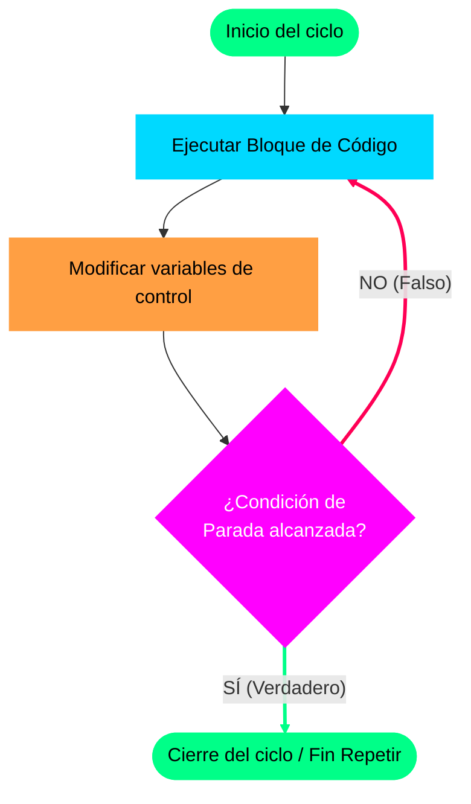

# Capítulo 3: El Ciclo "Repetir" (Do-While / Repeat)

El ciclo **Repetir** es la estructura de control cíclica ideal para situaciones en las que necesitamos asegurar que un conjunto de instrucciones se ejecute **al menos una vez**, sin importar el estado inicial de la condición lógica.

---

## Concepto Fundacional

A diferencia del ciclo Mientras, que realiza una evaluación "previa" (antes de permitir la entrada), el ciclo **Repetir** realiza una evaluación "posterior" (al final de la iteración).

### Diferencia Crítica:
- **Mientras (Evalúa al Inicio):** Si la condición es falsa desde el principio, el bloque de código interno **nunca se ejecuta** (0 iteraciones).
- **Repetir (Evalúa al Final):** El código se ejecuta primero de arriba hacia abajo y, al llegar al final, se evalúa si se debe repetir. Por lo tanto, **siempre se ejecutará al menos una vez** (1 o más iteraciones).



---

## Sintaxis y Estructura en UDONE

En nuestro pseudocódigo, la estructura se implementa utilizando las palabras clave `Repetir` y `Hasta Que`:

```pseudocodigo
Repetir
    // Instrucciones que se ejecutan al menos una vez
    // Modificación de variables de control
Hasta Que (Condición_de_Parada)
```

> [!IMPORTANT]
> **Regla de Operación de `Hasta Que`:** Este ciclo se repite **mientras la condición sea Falsa**. En el momento exacto en que la condición lógica dentro de los paréntesis `( )` se vuelve **Verdadera**, el ciclo se detiene y la ejecución continúa con la siguiente línea de código fuera del bucle. Funciona como una condición de parada o término.

---

## El Caso de Uso Ideal: Validación de Entrada de Datos

La validación de datos suministrados por el usuario es el ejemplo perfecto para aplicar este ciclo. 

Imagina que solicitas la nota definitiva de un estudiante en una escala de `0 a 20` puntos. No puedes validar si la nota es correcta antes de pedirla; obligatoriamente debes pedirla primero (acción inicial), y si el usuario introduce un dato absurdo (como `-5` o `99`), debes volver a pedirla sucesivamente hasta que el dato sea correcto.

---

## Ejemplo Práctico: Validador de Notas de Examen

### Explicación de la Lógica:
- Queremos pedir la nota de un examen. La nota es válida si se encuentra en el rango de `0` a `20` inclusive.
- Condición de Parada: El ciclo debe dejar de repetirse **cuando la nota ingresada sea válida**; es decir, cuando `(nota >= 0) Y (nota <= 20)`.
- Si el usuario introduce una nota inválida, la condición de parada será `Falsa`, obligando al ciclo a repetirse y solicitar el dato nuevamente.

### Algoritmo en Pseudocódigo UDONE:

```pseudocodigo
Algoritmo Validador_De_Notas
Variables:
    nota: Real  // Almacenará la nota ingresada por el usuario

Inicio
    Escribir "--- SISTEMA DE REGISTRO DE CALIFICACIONES (UDONE) ---"

    // Iniciamos la estructura Repetir
    Repetir
        Escribir "Ingrese la nota definitiva del estudiante (Escala 0 a 20): "
        Leer nota

        // Evaluamos si la nota está fuera del rango permitido para alertar al usuario
        Si (nota < 0 O nota > 20) Entonces
            Escribir "¡ERROR! La nota ingresada no es válida. Debe ser entre 0 y 20."
        Fin Si

    Hasta Que (nota >= 0 Y nota <= 20) // El ciclo se detiene cuando la nota es correcta

    // Salida final una vez superada la validación
    Escribir "Nota registrada exitosamente con un valor de: " + nota
    Escribir "Fin del programa."
Fin
```

---

## Diseño

- **Componente Interactivo:** "Interactive Form Validator Simulator".
- **Layout:** Interfaz dividida en tres paneles funcionales:
  - **Izquierda (Consola):** Simula una interfaz de terminal donde el estudiante ingresa notas para probar el algoritmo.
  - **Centro (Código):** Resalta en vivo la ejecución del bloque de código.
  - **Derecha (Inspector de Estado):** Un gráfico dinámico que evalúa la condición de parada `(nota >= 0 Y nota <= 20)` mostrando en color verde si se cumple (permitiendo salir) o en rojo si falla (reiniciando el bucle).
- **Interactividad:**
  - Si el estudiante introduce un valor inválido (ej: `25`), la pantalla de la consola parpadea ligeramente en rojo y se muestra la advertencia en pantalla, devolviendo el cursor a la instrucción `Leer`.
  - Si introduce un valor válido (ej: `15`), el flujo avanza de inmediato hacia la instrucción de salida final con una animación de éxito (celebración de confetti digital discreta).
- **Estética:** Combinación de tonos gris oscuro, violeta para las condiciones activas y bordes brillantes con iluminación LED que cambian dinámicamente según la validez del dato ingresado.
