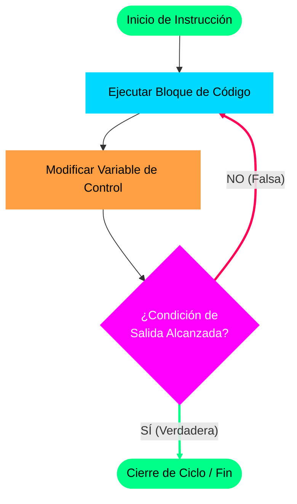

# Apoyo Visual: El Ciclo "Repetir" y Lógica de Parada (Parte 3)

**Fecha de creación del artículo:** 19/05/2026  
**Referencia de Video:** Publicado originalmente el 10 de marzo de 2021  
**Enlace al video:** [Ver en YouTube (Enlace Oficial)](https://youtu.be/J6q6NchWwF8)  
**Canal:** AlejjandroDev  
**Métrica de la Clase:** Video 3/4 sobre Estructuras Repetitivas

---

## 1. Resumen Técnico del Material Audiovisual

Este tercer capítulo audiovisual se enfoca en el estudio del ciclo **Repetir** (*Do-While* / *Repeat-Until*). El objetivo principal consiste en contrastar fuertemente la **lógica de evaluación inversa** de esta estructura frente al ciclo *Mientras* analizado en el capítulo anterior, utilizando el marco formal del diseño de algoritmos.

La distinción académica fundamental reside en la ubicación y el propósito de la evaluación condicional:
- **El Ciclo Mientras (Condición de Entrada):** Actúa como un filtro previo. La evaluación lógica ocurre al **inicio** de la estructura. Si la condición resulta falsa antes del primer ciclo, el código interno es ignorado en su totalidad.
- **El Ciclo Repetir (Condición de Salida):** Actúa como una compuerta posterior. La evaluación lógica se realiza estrictamente al **final** de cada iteración, tras la ejecución de las instrucciones internas.



### Comportamientos Clave del Ciclo Repetir:
1.  **Ejecución Garantizada:** Debido a que la prueba lógica ocurre al final, el bloque de instrucciones interno del bucle **siempre se ejecutará al menos una vez** (la primera iteración se ejecuta de forma incondicional).
2.  **Lógica Booleana Inversa:** 
    *   El ciclo *Mientras* requiere una condición **Verdadera** para iterar y se detiene cuando esta es **Falsa**.
    *   El ciclo *Repetir* requiere que la condición sea **Falsa** para seguir iterando y **sale de la estructura de inmediato cuando la condición es Verdadera** (funciona como condición de parada).

---

## 2. Criterios de Selección y Estructura

### ¿Cuándo utilizar cada estructura cíclica?
Para orientar la toma de decisiones lógicas en el estudiante, el video detalla la siguiente regla práctica:

*   **Usar Repetir:** Cuando sea obligatorio o necesario que las instrucciones se ejecuten por lo menos una vez para poder operar.
    *   *Ejemplo clásico:* Mostrar un menú de opciones interactivo. Primero debes imprimir el menú en pantalla obligatoriamente para que el usuario pueda tomar su decisión.
*   **Usar Mientras:** Cuando exista el escenario de que el ciclo no deba ejecutarse bajo ninguna circunstancia debido a los valores de entrada.
    *   *Ejemplo clásico:* Procesar los datos de una lista de alumnos. Si la lista está vacía, no tiene sentido ingresar al ciclo a leer datos; debe evadirse de forma inmediata.

### Sintaxis en Pseudocódigo (UDONE):

```pseudocodigo
Repetir
    // Bloque de instrucciones que se ejecuta al menos 1 vez
    // Modificación de la variable de control
Hasta (condicion_de_salida_sea_verdadera)
```

> [!NOTE]
> **Nota de Sintaxis:** En cumplimiento con las últimas actualizaciones del lenguaje UDONE, emplearemos la directiva `Hasta` (evaluada como condición de parada) para delimitar el fin de la iteración.

---

## 3. Ejemplo Práctico: Sumador de Números (Versión Repetir)

Para evidenciar la diferencia estructural directa, adaptamos el mismo algoritmo del Capítulo 2 (Suma Acumulada de números) pero implementando el ciclo `Repetir`.

```pseudocodigo
Algoritmo sumador_de_numeros_repetir
    // Declaración de variables
    Definir cantidad_numeros, numero, suma Como Entero
    
Inicio
    // 1. Inicialización obligatoria del acumulador (Regla de Oro)
    suma <- 0
    
    // Lectura de la cantidad total esperada
    Escribir "Ingrese la cantidad de números a sumar: "
    Leer cantidad_numeros
    
    // 2. Ejecución directa e incondicional
    Repetir
        Escribir "Ingrese un número: "
        Leer numero
        
        // Acumulación y decremento de la variable controladora
        suma <- suma + numero
        cantidad_numeros <- cantidad_numeros - 1
        
    // 3. Evaluación al final (Se detiene cuando la cantidad llega a 0)
    Hasta (cantidad_numeros = 0)
    
    // Impresión del resultado final
    Escribir "La suma total es: " + suma
    
Fin Algoritmo
```

---

## 4. Prueba de Escritorio (Traza de Ejecución)

A continuación, analizaremos el flujo para una entrada de **5 números** (`cantidad_numeros = 5`) con la secuencia de números `3`, `4`, `7`, `2`, `1`.

1.  **Inicio Directo (Iteración 1):** Al arrancar la estructura `Repetir`, el algoritmo **no realiza ninguna pregunta lógica**. Ingresa directamente al bloque, solicita el primer número (`3`), acumula su valor (`suma = 3`) y reduce la cuenta en uno (`cantidad_numeros = 4`).
2.  **Evaluación de Salida:** Al alcanzar la directiva final, se evalúa:
    *   *¿`cantidad_numeros` es igual a 0?* $\rightarrow$ `(4 = 0)` resulta **Falso**. Como es falso, el bucle repite y vuelve al bloque de arriba.
3.  **Iteraciones Intermedias:** 
    *   *Vuelta 2:* Lee `4` $\rightarrow$ `suma = 7` $\rightarrow$ `cantidad_numeros = 3`. Evalúa `(3 = 0)` $\rightarrow$ Falso $\rightarrow$ Repite.
    *   *Vuelta 3:* Lee `7` $\rightarrow$ `suma = 14` $\rightarrow$ `cantidad_numeros = 2`. Evalúa `(2 = 0)` $\rightarrow$ Falso $\rightarrow$ Repite.
    *   *Vuelta 4:* Lee `2` $\rightarrow$ `suma = 16` $\rightarrow$ `cantidad_numeros = 1`. Evalúa `(1 = 0)` $\rightarrow$ Falso $\rightarrow$ Repite.
4.  **Iteración Final y Salida:** 
    *   *Vuelta 5:* Lee `1` $\rightarrow$ `suma = 17` $\rightarrow$ `cantidad_numeros = 0`.
    *   Al evaluar la salida: *¿`cantidad_numeros` es igual a 0?* $\rightarrow$ `(0 = 0)` resulta **Verdadero**.
    *   Al ser Verdadero, la condición de parada se cumple. El ciclo finaliza y permite la salida del bucle, imprimiendo en consola: `La suma total es: 17`.
